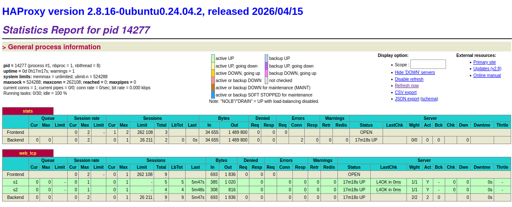
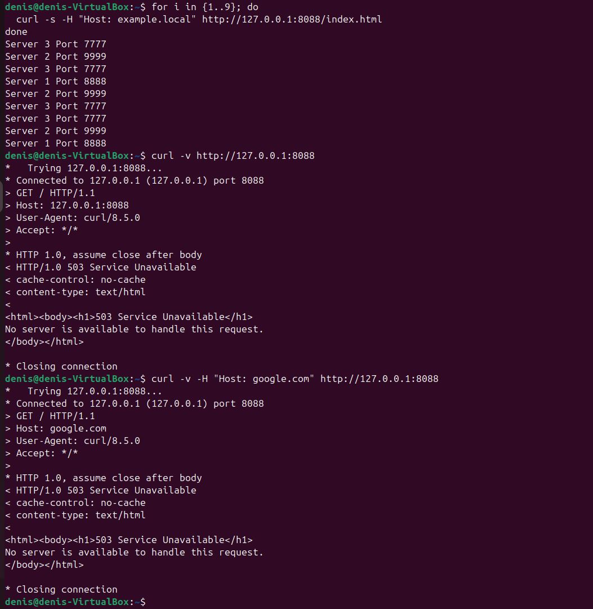
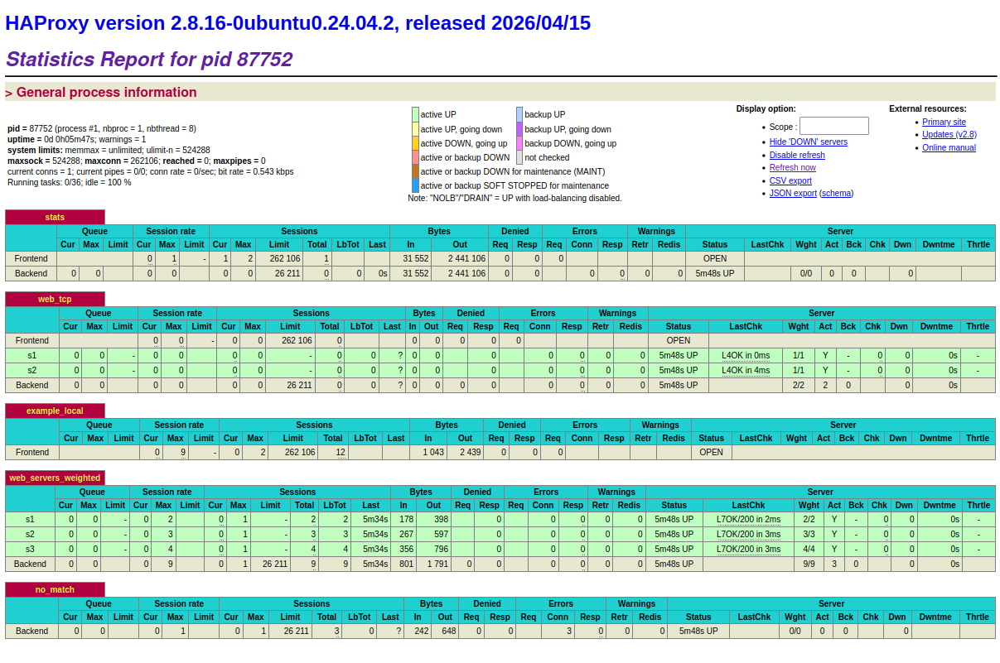

# Домашнее задание к занятию 2 «Кластеризация и балансировка нагрузки» - Мурашов Денис

## Задание 1

Настроил HAProxy. Файл: haproxy.cfg

## Задание 2

Файл: haproxy2.cfg

Настроена балансировка Weighted Round robin на 7 уровне на порту :8088.
Веса серверов: s1 = 2, s2 = 3, s3 = 4.
HAProxy балансирует только трафик с заголовком Host: example.local

